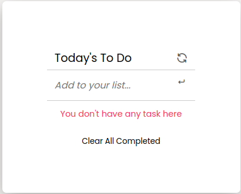
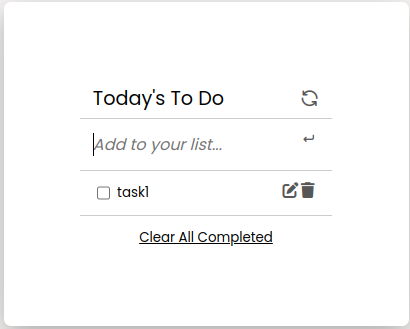
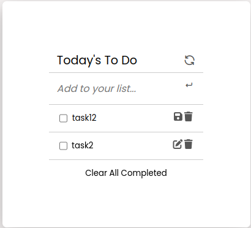
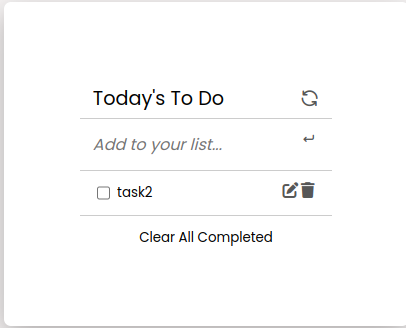

# To Do List 📝

<div align="center">

  
  <br/>

</div>

## A solo programming project that heighlights the use of webpack to bundle JavaScript, ES6 syntax

# 🛠 Built With

### Tech Stack

- HTML5.
- CSS3.
- Javascript using ES6.
- Webpack.

### Client

- HTML.
- CSS.
- JS.
- Webpack

# 🚀 Live Demo <a name="live-demo"></a>

[To Do List 📝](https://salwa99.github.io/To-Do-List/)
<div>




</div>

### Server

- local.

### Database

- N/A.

# Key Features

- HTML5 semantics.
- CSS3.
- Javascript OOP, ES6.
- Webpack.

# 💻 Getting Started

### To get a local copy up and running, follow these steps

1. Installed Git.
2. Create a local directory that you want to clone the repository.
3. Open the command prompt in the created directory.
4. On the terminal run this command git clone <https://github.com/Salwa99/To-Do-List.git>
5. Install the dev dependencies for linters run npm install.
6. run: ```npm  i --save-dev webpack webpack-cli webpack-dev-server @babel/core @babel/preset-env babel-loader style-loader css-loader sass-loader html-webpack-plugin mini-css-extract-plugin ```

After Installing all the packages run this command ``` npm run start ``` to start dev server and you can just press ```Ctrl + C``` in the terminal and that will kill it and run ``` npm run build ``` to creates a build directory with a production build of your app . 
# Prerequisites

### In order to run this project you need

- Installed Git.
- A browser.

# Setup

- Clone this repository to your desired folder.

# Install

### Install this project with

- Git.
- Github.

# Usage

### To run the project, execute the following command

- git clone <https://github.com/Salwa99/To-Do-List.git>
- cd To-Do-List

# Run tests

### To run tests, run the following command

- npx eslint .
- npx stylelint "**/*.{css,scss}"

# Deployment

### You can deploy this project using

- Github pages.

# 👥 Authors

### 👤 Salwa Ballouti

- GitHub: [@Salwa99](https://github.com/Salwa99)
- Twitter: [@SalwaBallouti](https://twitter.com/salwa_ballouti)
- LinkedIn: [LinkedIn](https://www.linkedin.com/in/salwa-ballouti-096358251/)

# 🔭 Future Features

- Use advanced JS data structures.
- Implement some awesome animations and transitions to the design.
- Integrate back-end.

# 🤝 Contributing

Contributions, issues, and feature requests are welcome!
Feel free to check the issues page.

# ⭐️ Show your support

If you like this project kindly send to me an e-mail expressing it, it would make my day and fuel my motivation.

# 🙏 Acknowledgments

I would like to thank Microverse team for this journey.

# ❓ FAQ

### How do I clone this with all the un-merged branches?

- Kindly check the branches names in github then add them manually on your local machine, after that you may just pull the changes.

### How to access the database?

- It's not available for now I'm still working on it, once it's available I'll update this answer.

# 📝 License

This project is MIT licensed.
